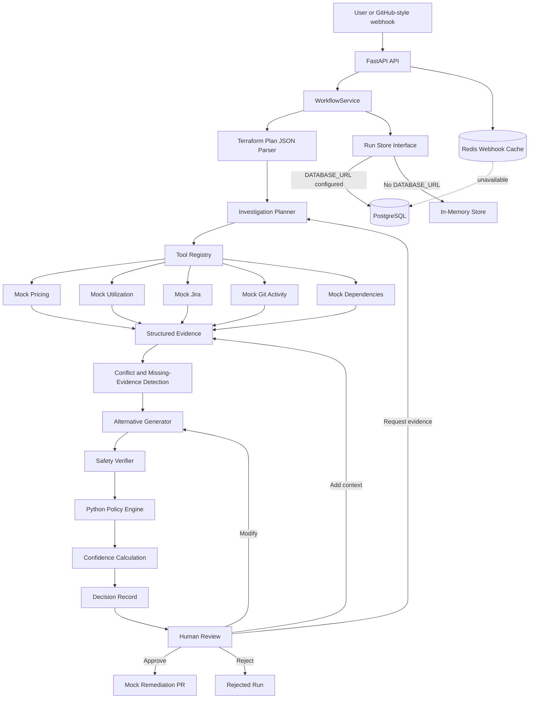

# GhostBusters Project Status and System Flow

## 1. Project Overview

GhostBusters is a safety-focused FinOps remediation agent for Terraform infrastructure. It investigates whether a cloud resource can be optimized, collects technical and business evidence, generates several possible actions, verifies the preferred action against safety rules, and requires human approval before producing a remediation pull-request preview.

The current repository is a working backend prototype for the NeuroX 1.0 Phase 2 hackathon. It uses deterministic decision logic and mock external evidence sources. PostgreSQL persistence is implemented, while Redis webhook deduplication is implemented but has not been tested against a live Redis server on this machine.

## 2. Current Verified State

| Area | State | Notes |
|---|---|---|
| FastAPI backend | Working | Health, workflow, review, reset, and webhook endpoints exist. |
| Terraform plan parsing | Working | Parses prepared Terraform plan JSON fixtures. |
| Demo scenarios | Working | Six safety and evidence scenarios are included. |
| Investigation planning | Working | Selects relevant evidence tools based on the resource and goal. |
| Evidence collection | Working | Uses mock pricing, utilization, Jira, Git, and dependency tools. |
| Alternatives and confidence | Working | Produces multiple actions and an evidence-based confidence score. |
| Safety verifier | Working | Checks risks before a recommendation reaches human review. |
| Python policy engine | Working | Blocks unsafe production and destructive operations. |
| Human review | Working | Approve, reject, modify, request evidence, and add context are supported. |
| Audit trail | Working | Workflow and review events are recorded in sequence. |
| PostgreSQL storage | Implemented and smoke-tested | Runs survive construction of a new service/store instance. |
| Redis deduplication | Implemented and unit-tested | No live Redis server is installed on the current machine. |
| Automated tests | Passing | 68 tests pass; one dependency deprecation warning remains. |
| Web interface | Placeholder | HTML exists, but JavaScript is not wired to the API. |
| Real GitHub PR creation | Not implemented | The current implementation produces a mock PR record. |
| Webhook signature validation | Not implemented | Delivery and event headers are checked, but signatures are not verified. |
| Real LLM reasoning | Not implemented | Planning and reasoning are currently deterministic Python logic. |
| LangGraph | Not implemented | The workflow is coordinated by `WorkflowService`. |
| OPA/Conftest | Implemented | Rego runs through Conftest when available, with fail-safe Python fallback. |
| Retry/backoff | Not implemented | External-call retry handling remains future work. |
| Approval tokens and waiver behavior | Not implemented | The waiver table exists, but workflow enforcement does not. |
| Post-deployment savings check | Not implemented | Predicted-versus-actual savings are not yet recorded. |

## 3. Implemented Components

### API layer

`app/main.py` exposes:

- `GET /health` — service health check.
- `GET /` — returns the static HTML page.
- `GET /api/scenarios` — lists available demonstration scenarios.
- `POST /api/runs` — starts an investigation.
- `GET /api/runs` — lists stored workflow runs.
- `GET /api/runs/{run_id}` — returns one workflow run.
- `POST /api/runs/{run_id}/review` — processes a human-review action.
- `POST /api/reset` — clears stored workflow runs.
- `POST /webhooks/github` — accepts a simplified GitHub pull-request event.

### Demo scenarios

The repository contains six scenarios:

1. `safe` — a staging resource with consistently low utilization and a safe downsize opportunity.
2. `production` — a production resource that must receive stricter treatment.
3. `destructive` — a Terraform plan containing a delete action.
4. `missing_evidence` — important evidence sources are unavailable.
5. `dependency` — a low-utilization resource still has active downstream dependencies.
6. `conflicting` — Jira, Git activity, and utilization signals disagree.

### Evidence tools

The Investigator can select these mock integrations:

- Pricing
- Utilization
- Jira project information
- Git activity
- Dependency information

Every evidence item records its source, claim, value, collection time, freshness, reliability, resource ID, and metadata. Unavailable information is stored explicitly instead of being invented.

### Decision and safety logic

The backend currently performs:

- Investigation planning and selective tool execution
- Missing-evidence identification
- Cross-source conflict detection
- Alternative generation
- Preferred-action selection
- Confidence calculation
- Verifier checks
- Deterministic policy evaluation
- Abstention or additional-evidence requests when confidence is insufficient
- Hard blocking for unsafe production or destructive cases

### Human review

Supported review actions are:

- `approve` — authorizes creation of a mock remediation PR.
- `reject` — rejects the recommendation.
- `modify` — changes the preferred action to another eligible alternative.
- `request_evidence` — reruns only the requested evidence tools.
- `add_context` — adds reviewer-supplied context as evidence and recalculates the decision.

## 4. System Architecture



## 5. End-to-End Working Flow

### Step 1: Receive a goal

A user calls `POST /api/runs`, or the simplified GitHub webhook creates the same request internally.

Example request:

```json
{
  "goal": "Reduce staging compute cost safely",
  "scenario_name": "safe",
  "idempotency_key": "demo-run-001"
}
```

The service checks the idempotency key. If it already exists, the existing run is returned.

### Step 2: Create and persist the run

The system creates a `WorkflowRun`, records `run_created` and `goal_received` audit events, and saves the initial state.

If `DATABASE_URL` is configured, the run is saved in PostgreSQL. Otherwise, it is stored in application memory.

### Step 3: Parse the Terraform plan

The selected scenario points to a Terraform plan JSON fixture. The parser identifies the resource address, action, environment, current configuration, proposed configuration, tags, and whether the change is destructive.

The current prototype does not execute the Terraform CLI; it parses existing JSON fixtures.

### Step 4: Build an investigation plan

The planner evaluates the goal and resource. It chooses only relevant tools rather than executing every tool automatically. Destructive or production cases can skip normal optimization work and move directly toward safe blocking.

### Step 5: Collect structured evidence

The selected mock tools return evidence. Each execution and result is recorded. Tool failures produce unavailable evidence rather than fabricated values.

### Step 6: Detect missing or conflicting information

The system checks whether critical evidence is unavailable and whether sources disagree. For example, Jira may report that a project is complete while recent Git activity suggests it is active.

### Step 7: Generate alternatives

The optimizer produces several possible actions, such as:

- Keep the resource
- Downsize it
- Schedule operating hours
- Delay the change
- Request more evidence
- Abstain

Each alternative includes savings, risk, eligibility, reversibility, and approval requirements.

### Step 8: Verify and apply policy

The Verifier challenges the preferred action. A sanitized policy input is evaluated by the Rego package through Conftest. If Conftest is unavailable, malformed, disabled, or times out, the deterministic Python policy engine provides a fail-safe fallback. Both paths block unsafe production changes, unexpected destructive actions, unknown ownership, active dependencies, insufficient evidence, low confidence, or critical verifier failures.

### Step 9: Calculate confidence

Confidence is calculated from evidence coverage, freshness, reliability, conflicts, missing evidence, and policy results. Low confidence causes the workflow to request more evidence or abstain.

### Step 10: Wait for a human

A safe recommendation moves to `pending_human_review`. Unsafe cases move to `blocked`, `abstained`, `keep`, or `needs_more_evidence`.

### Step 11: Process the review

The reviewer may approve, reject, modify, request more evidence, or add context. The workflow recalculates the decision when new evidence or context is supplied.

Approval currently creates a `MockPullRequest` containing a branch name, Terraform patch preview, predicted monthly and annual savings, confidence, policy summary, and approval summary. It does not call the real GitHub API.

### Step 12: Persist updates and audit history

Every update increases the run version and writes the complete run snapshot plus normalized evidence, approval, and audit records to PostgreSQL.

## 6. Persistence and Deduplication

### PostgreSQL

The database schema contains:

- `workflow_runs` — complete workflow snapshots and key searchable fields.
- `evidence_records` — normalized evidence for reporting.
- `approvals` — normalized human-review records.
- `waivers` — storage prepared for future waiver functionality.
- `audit_log` — ordered workflow history.

`PostgresRunStore.update()` locks the run row with `SELECT ... FOR UPDATE`, increments its version, updates the full JSON snapshot, and synchronizes the normalized child tables inside one transaction.

### Redis

For a GitHub-style webhook, the `X-GitHub-Delivery` value is used as the deduplication key. Redis maps that delivery ID to the created workflow run for 24 hours.

If Redis is unavailable, the adapter catches the Redis error. The workflow continues, and PostgreSQL's unique idempotency key remains the durable duplicate-prevention mechanism.

## 7. Running the Current System

From PowerShell:

```powershell
cd D:\Nutrex\GhostBusters
.\.venv\Scripts\Activate.ps1
python -m pip install -r requirements.txt
python -m uvicorn app.main:app --reload
```

The command must run from `D:\Nutrex\GhostBusters`, not from its parent directory.

Useful URLs:

- Application: `http://127.0.0.1:8000`
- API documentation: `http://127.0.0.1:8000/docs`
- Health check: `http://127.0.0.1:8000/health`

Run the test suite:

```powershell
python -m pytest -q
```

Current expected result:

```text
83 passed, 1 optional Conftest integration test skipped when Conftest is unavailable
```

## 8. Example API Demonstration

Create a workflow run:

```powershell
$body = @{
    goal = "Reduce staging compute cost safely"
    scenario_name = "safe"
    idempotency_key = "demo-run-001"
} | ConvertTo-Json

$run = Invoke-RestMethod `
    -Method Post `
    -Uri http://localhost:8000/api/runs `
    -ContentType "application/json" `
    -Body $body

$run | Format-List id, status, version, idempotency_key
```

List stored runs:

```powershell
Invoke-RestMethod http://localhost:8000/api/runs
```

Approve a safe recommendation:

```powershell
$review = @{
    action = "approve"
    reviewer = "demo-reviewer"
    comment = "Approved during the live demonstration"
} | ConvertTo-Json

Invoke-RestMethod `
    -Method Post `
    -Uri "http://localhost:8000/api/runs/$($run.id)/review" `
    -ContentType "application/json" `
    -Body $review
```

## 9. Remaining Implementation Order

The recommended remaining work is:

1. Add retry and exponential backoff for external calls.
2. Add signed, expiring, user-specific approval tokens and complete waiver behavior.
3. Add predicted-versus-actual post-deployment savings tracking.
4. Replace the placeholder page with a working API-driven UI.
5. Add real GitHub webhook validation and pull-request creation.
6. Add one real LLM Investigator call with explainable structured output.
7. Add a minimal LangGraph state graph with conditional routing.
8. Prepare the final live demonstration guide.

## 10. Important Demo Limitations

The current prototype must not be presented as performing real infrastructure remediation. It uses Terraform JSON fixtures, mock evidence tools, Rego/Conftest policy with a Python fallback, and mock pull-request records. PostgreSQL persistence is real. Conftest and Redis adapters are coded and unit-tested, but live Conftest and Redis executables/services still need to be installed or started for complete integration demonstrations.
